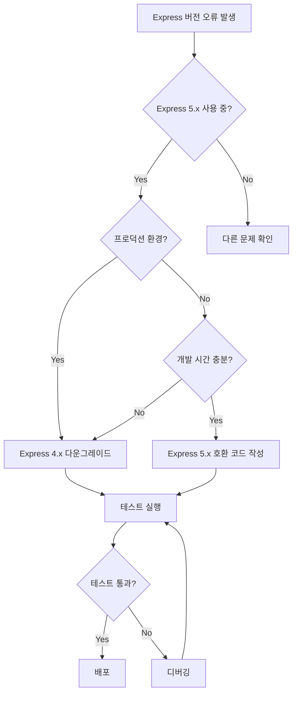

# Express 호환성 문제 해결 워크플로우
## Reusable Workflow for Express Version Compatibility Issues

---

## 🎯 목적
Express.js 버전 충돌 및 path-to-regexp 호환성 문제를 체계적으로 해결하기 위한 표준 워크플로우

---

## 🔍 문제 식별 체크리스트

### 증상 확인
- [ ] `TypeError: Missing parameter name` 오류 발생
- [ ] 라우트 파라미터 (`:id`, `:param`) 인식 실패
- [ ] `path-to-regexp` 관련 오류 메시지
- [ ] Express 앱 시작 실패

### 진단 명령어
```bash
# 1. Express 버전 확인
npm ls express

# 2. path-to-regexp 버전 확인
npm ls path-to-regexp

# 3. 충돌하는 패키지 확인
npm ls router

# 4. 전체 의존성 트리 확인
npm list --depth=2
```

---

## 🛠️ 해결 프로세스

### Option A: Express 4.x 다운그레이드 (권장)

#### Step 1: 백업
```bash
# package.json 백업
cp package.json package.json.backup
cp package-lock.json package-lock.json.backup
```

#### Step 2: 의존성 수정
```bash
# Express 및 타입 정의 다운그레이드
npm uninstall express @types/express
npm install express@4.19.2
npm install --save-dev @types/express@^4.17.21
```

#### Step 3: 클린 설치
```bash
# 캐시 및 모듈 삭제
rm -rf node_modules package-lock.json
npm cache clean --force

# 재설치
npm install
```

#### Step 4: 검증
```javascript
// test-server.js
const express = require('express');
const app = express();

app.get('/test/:id', (req, res) => {
  res.json({ 
    id: req.params.id, 
    express: require('express/package.json').version 
  });
});

app.listen(3001, () => {
  console.log('Test server running on port 3001');
});
```

```bash
node test-server.js
curl http://localhost:3001/test/123
```

---

### Option B: Express 5.x 호환성 수정

#### Step 1: 라우트 구문 업데이트
```typescript
// Before (Express 4.x)
router.get('/:id', handler);

// After (Express 5.x)
router.get('/{id}', handler);  // 또는
router.get('/:id(\\d+)', handler);  // 정규식 패턴 명시
```

#### Step 2: 미들웨어 호환성 레이어 추가
```typescript
// middleware/express5-compat.ts
import { Router } from 'express';

export function createCompatRouter(): Router {
  const router = Router();
  
  // 커스텀 파라미터 파싱
  router.param('id', (req, res, next, id) => {
    req.params.id = id;
    next();
  });
  
  return router;
}
```

#### Step 3: validateRequest 수정
```typescript
// middleware/validation.ts
export const validateRequest = (schema: any) => {
  return (req: Request, res: Response, next: NextFunction) => {
    try {
      // Express 5.x 호환 파싱
      const parsed = schema.parse({
        body: req.body,
        query: req.query,
        params: req.params
      });
      
      Object.assign(req, parsed);
      next();
    } catch (error) {
      next(error);
    }
  };
};
```

---

## 🧪 테스트 전략

### 1. 단위 테스트
```javascript
// test/routes.test.js
describe('Route Parameters', () => {
  it('should parse :id parameter', async () => {
    const response = await request(app)
      .get('/api/users/123')
      .expect(200);
    
    expect(response.body.id).toBe('123');
  });
});
```

### 2. 통합 테스트
```bash
# 모든 라우트 테스트
npm test -- --testPathPattern=routes

# 특정 엔드포인트 테스트
curl -X GET http://localhost:3001/api/users/123
curl -X POST http://localhost:3001/api/auth/login -d '{"email":"test@example.com"}'
```

### 3. 부하 테스트
```bash
# Apache Bench 사용
ab -n 1000 -c 10 http://localhost:3001/health

# 또는 autocannon 사용
npx autocannon -c 10 -d 30 http://localhost:3001/health
```

---

## 📋 트러블슈팅 가이드

### 문제 1: npm 캐시 이슈
```bash
# 해결책
npm cache clean --force
rm -rf ~/.npm
```

### 문제 2: workspace 충돌
```bash
# 해결책
cd project-root
npm install --workspaces=false
```

### 문제 3: TypeScript 타입 오류
```bash
# 해결책
rm -rf node_modules/@types
npm install --save-dev @types/node @types/express@^4.17.21
```

### 문제 4: nodemon 재시작 루프
```json
// nodemon.json 수정
{
  "ignore": ["*.test.ts", "*.spec.ts", "node_modules", "dist"],
  "delay": "500ms"
}
```

---

## 🔄 자동화 스크립트

### fix-express.sh
```bash
#!/bin/bash

echo "🔧 Fixing Express compatibility issues..."

# 1. 백업
cp package.json package.json.$(date +%Y%m%d_%H%M%S).backup

# 2. Express 다운그레이드
npm uninstall express @types/express
npm install express@4.19.2
npm install --save-dev @types/express@^4.17.21

# 3. 클린 설치
rm -rf node_modules package-lock.json
npm cache clean --force
npm install

# 4. 테스트
node -e "console.log('Express version:', require('express/package.json').version)"

echo "✅ Express compatibility fix completed!"
```

### 사용법
```bash
chmod +x fix-express.sh
./fix-express.sh
```

---

## 📊 의사결정 트리



---

## 🎯 Best Practices

### 1. 버전 고정
```json
{
  "dependencies": {
    "express": "4.19.2",  // ^ 제거하여 정확한 버전 고정
    "path-to-regexp": "0.1.7"
  }
}
```

### 2. CI/CD 파이프라인
```yaml
# .github/workflows/test.yml
- name: Check Express Version
  run: |
    EXPRESS_VERSION=$(npm ls express --json | jq -r '.dependencies.express.version')
    if [[ $EXPRESS_VERSION != "4.19.2" ]]; then
      echo "Wrong Express version: $EXPRESS_VERSION"
      exit 1
    fi
```

### 3. 문서화
- 모든 Express 버전 의존성 명시
- 마이그레이션 가이드 유지
- 팀원 교육 자료 준비

---

## 🔗 참고 자료

- [Express 5.x Migration Guide](https://expressjs.com/en/guide/migrating-5.html)
- [path-to-regexp Breaking Changes](https://github.com/pillarjs/path-to-regexp/blob/master/History.md)
- [Express Route Parameters Documentation](https://expressjs.com/en/guide/routing.html)

---

## 📝 체크리스트

### 작업 전
- [ ] package.json 백업
- [ ] 현재 버전 기록
- [ ] 테스트 환경 준비

### 작업 중
- [ ] Express 버전 변경
- [ ] TypeScript 타입 업데이트
- [ ] 클린 설치 수행
- [ ] 기본 서버 테스트

### 작업 후
- [ ] 모든 라우트 테스트
- [ ] API 엔드포인트 검증
- [ ] 성능 테스트
- [ ] 문서 업데이트
- [ ] 팀 공유

---

**버전**: 1.0.0  
**작성일**: 2025-01-28  
**작성자**: Claude Opus 4.1 with SuperClaude/Agent/MCP  
**라이선스**: MIT